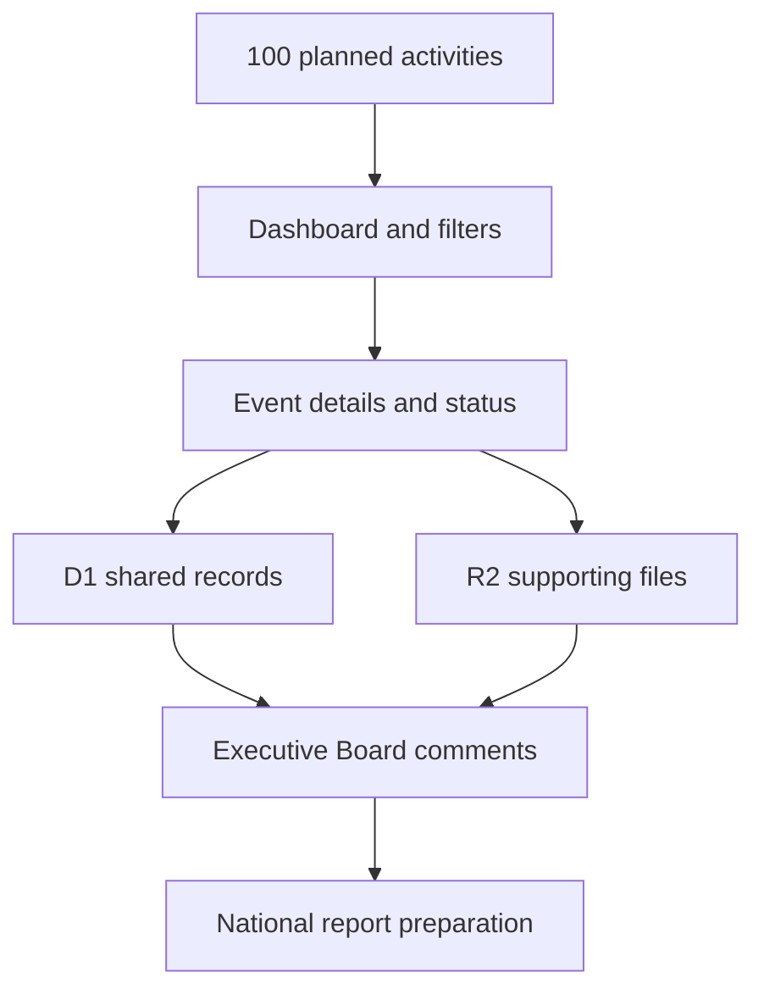
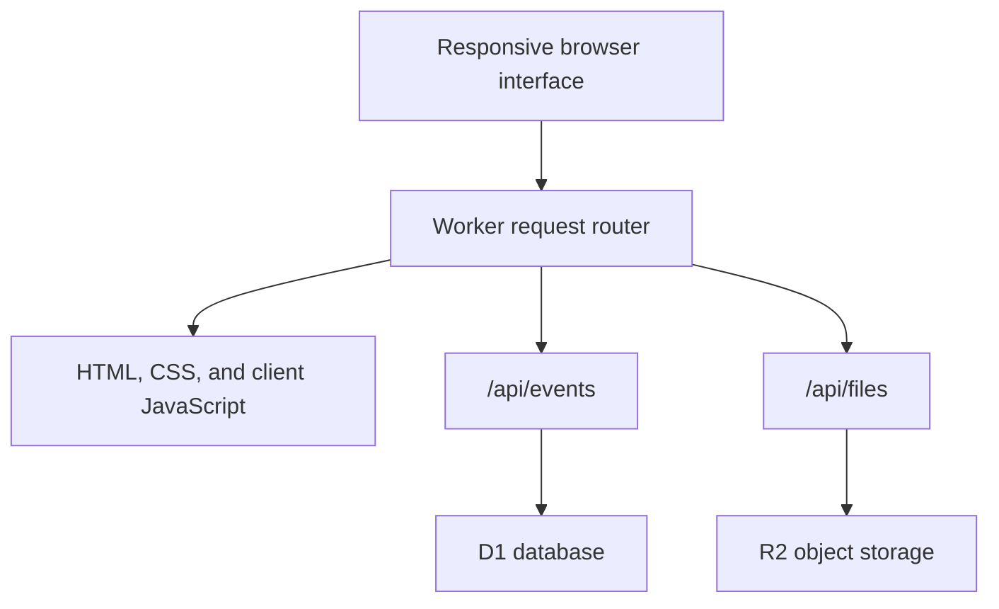

# 📊 UMKC NSBE Monthly Activity Report Tracker

A shared reporting workspace built for the **University of Missouri–Kansas City chapter of the National Society of Black Engineers (UMKC NSBE)**. The tracker turns a year-long activity plan into one organized system for preparing reports, monitoring progress, storing supporting files, and collecting Executive Board feedback.

> This repository contains the application source and its original 2026–2027 seed schedule. It does **not** contain the production database, uploaded evidence, or saved Executive Board comments.

## 🎯 Project Overview

The UMKC NSBE Executive Board previously had to manage activity-report information across calendars, forms, files, and separate conversations. This project brings that work into one responsive dashboard organized around the chapter's actual reporting process.

The tracker includes **100 activity reports**:

| Semester | Reports | Notes |
|---|---:|---|
| Fall 2026 | 53 | Includes five Fall activities without confirmed dates |
| Spring 2027 | 47 | January through May activities |
| **Full year** | **100** | 95 dated and 5 undated |

The application is a preparation and continuity tool for the chapter. It does not replace submission through NSBE's official national reporting form.

## ✨ Core Features

### Dashboard and progress tracking

- Live totals for all 100 reports
- Completion summaries for **Not Started**, **Gathering Information**, and **Submitted**
- Programming-lane distribution
- Fall, Spring, monthly, weekly, and undated views
- Clickable status and summary cards that open the relevant report list
- Semester-level totals and progress

### Event organization

- Stable NSBE IDs for every activity
- Sorting by NSBE ID, date, title, and other supported fields
- Search and filters for status, programming lane, week, month, and semester
- Separate programming-lane and subcategory controls
- Source-issue flags for missing or conflicting schedule information
- Dedicated panel for activities without confirmed dates

### Report preparation

- Event details form for title, date, duration, description, audience, attendance, cost, partnerships, delivery format, and other reporting fields
- Manual saving with visible success and error states
- Inline status updates
- Multiple supporting-file uploads
- Image and document previews
- File deletion and a 20 MB limit per uploaded file

### Executive Board workflow

- Dedicated **Executive Board Comments** workspace
- Multiple comments per event
- Multiple supporting files per comment
- Comment editing
- Single or multi-select comment deletion
- Comment counts visible from report tables and dashboard summaries

### Usability and reliability

- Responsive desktop, tablet, and phone layouts
- Collapsible sidebar with compact semester navigation
- Refresh-safe routes
- Browser back and forward navigation
- Restores the last meaningful view without flashing the dashboard
- Conflict-aware record merging when multiple people update the same report
- Seed-data fallback if shared records are temporarily unavailable

## 🧭 Programming-Lane System

Each report belongs to one primary programming lane and one related subcategory.

| Programming lane | Example subcategories |
|---|---|
| Academic Excellence / College Initiative | Study hall, mentoring, skill development, academic recognition |
| National Leadership Institute / Talent Development | Leadership workshops, professional development, networking |
| Technical Outreach Community Help (TORCH) | Community service, technical outreach, R.I.S.E. activities |
| Engineering Diversity / Technical Excellence | Career panels, technical talks, technical workshops |
| Pre-Collegiate Initiative | Mentoring, tutoring, workshops, and student competitions |
| Functional Zone Initiatives | General body meetings, membership events, and fundraisers |

When an activity could reasonably fit more than one lane, the chapter can use distribution counts and reporting intent to choose the most appropriate primary lane.

## 🔄 Application Flow



## 🏗️ Technical Architecture

The application is packaged as a compact, Cloudflare Worker-compatible JavaScript project.



### Technology

- JavaScript ES modules
- HTML and CSS generated by the Worker
- Cloudflare Worker-compatible runtime
- D1-compatible SQL storage for shared event records
- R2-compatible object storage for uploaded evidence
- Optimistic concurrency and record merging
- Responsive, accessible interface controls

## 📁 Project Structure

```text
UMKC-NSBE-Monthly-Activity-Report/
├── worker/
│   └── index.js                      # Interface, seed data, API, D1, and R2 logic
├── .openai/
│   └── hosting.example.json          # Example Sites binding configuration
├── .gitignore
├── package.json                      # Project metadata and production build command
└── README.md                         # Project documentation
```

## ⚙️ Data Model

The Worker creates an `events` table when the database is empty.

| Field | Purpose |
|---|---|
| `id` | Stable NSBE report identifier |
| `data` | JSON representation of the complete activity record |
| `updated_at` | Timestamp used for freshness and conflict protection |
| `updated_by` | Identity supplied by the hosting environment |

Uploaded files are stored separately under event-specific object keys. The database stores their metadata and references rather than embedding file contents in each event record.

## 🚀 Build and Deployment

### Requirements

- Node.js and npm
- A Worker-compatible hosting environment
- A D1-compatible database binding named `DB`
- An R2-compatible storage binding named `BUCKET`

### Build

```bash
npm run build
```

The build copies the Worker entry point to:

```text
dist/server/index.js
```

For a ChatGPT Sites deployment, copy `.openai/hosting.example.json` to `.openai/hosting.json` and let the Sites lifecycle create or assign the real project ID. Do not reuse another deployment's project ID.

## 🔐 Privacy and Operational Safety

- The public source repository does not include production database records.
- Uploaded attendance files, pictures, and Executive Board attachments are not included.
- The production URL is intentionally not published here because the operational tracker supports shared editing.
- A public or portfolio deployment should use a read-only demonstration mode or separate demonstration data.
- Chapter deployments should configure appropriate access before storing attendance information or internal comments.

## 🧪 Source-Data Notes

The 2026–2027 seed schedule preserves all 100 source records, including five activities without confirmed dates. Known source discrepancies remain visible through issue flags so future Executive Board members can resolve them without losing the original records.

The seed schedule should be reviewed and replaced for each new academic year. Programming lanes and subcategories may also change when NSBE updates its reporting framework.

## ⚠️ Known Limitations

- The initial schedule is specific to the 2026–2027 UMKC NSBE plan.
- Full operation requires database and object-storage bindings.
- The repository does not include an automated test suite.
- The compact single-Worker structure favors easy deployment over modular source organization.
- This tool prepares and tracks information; it does not automatically submit the official national NSBE report.

## 🌱 Future Improvements

- Read-only public demonstration mode
- Role-based editing permissions
- Annual schedule import and export
- Automated tests for reporting logic and route persistence
- Configurable programming lanes outside the main source file
- Reporting summaries that can be exported for chapter archives

## 👤 Project Leadership

**Project lead and tracker designer:** Abreham Mesfin  
**Organization:** National Society of Black Engineers — UMKC Chapter  
**Initial release:** July 2026  
**Status:** Active chapter workflow

## 📜 License and Trademarks

No open-source license is currently included. Public visibility allows the project to be viewed, but does not automatically grant permission to copy, redistribute, or reuse the source.

NSBE and UMKC names, marks, and logos belong to their respective owners. Their appearance in this educational chapter project does not imply separate institutional endorsement of this repository.

---

Built to make UMKC NSBE reporting more organized, transparent, and sustainable for future Executive Boards.
