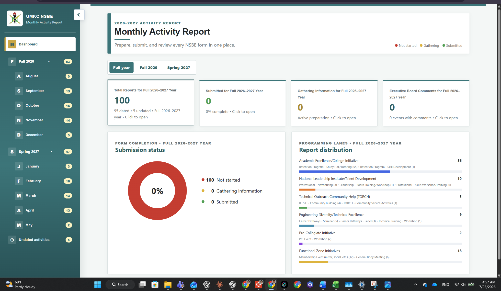
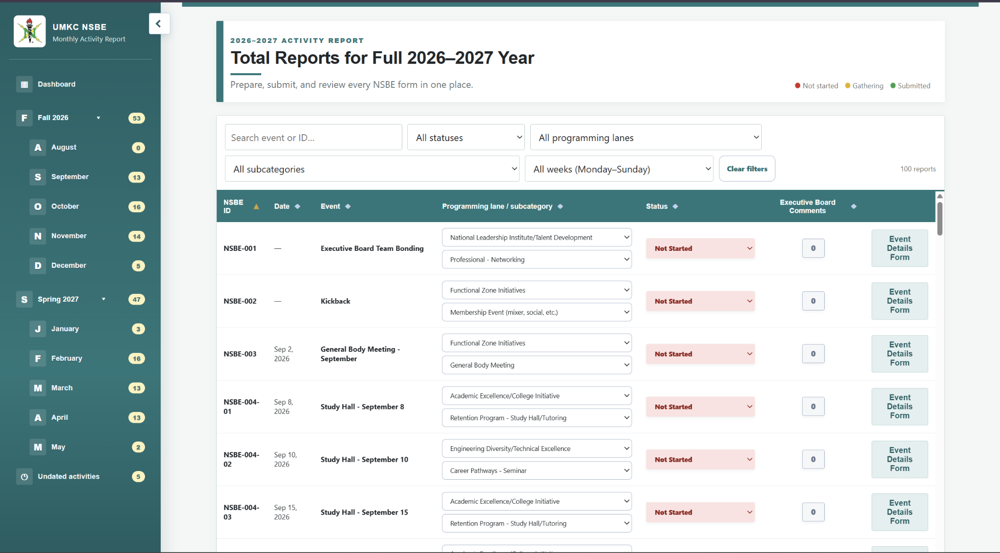
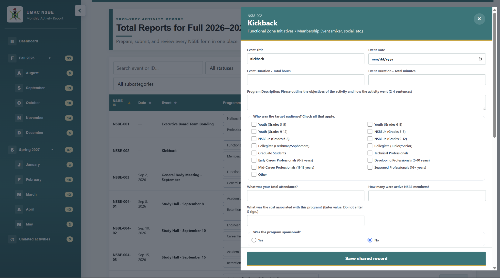
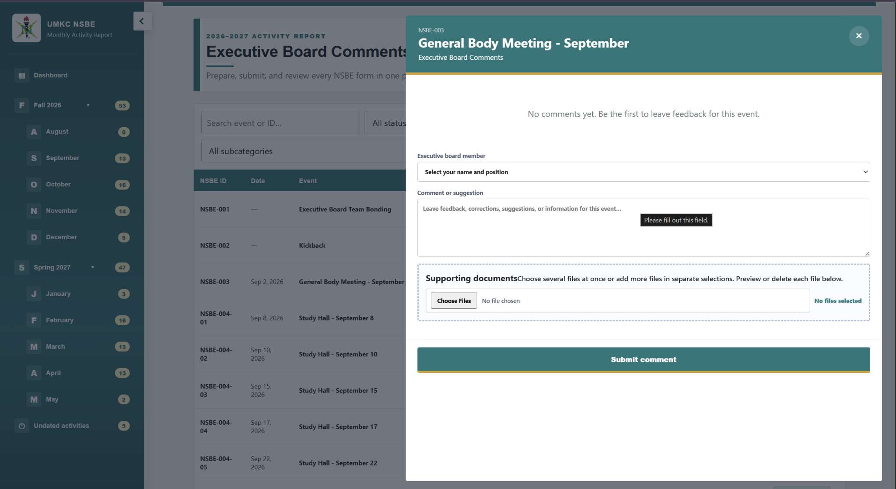

# UMKC NSBE Monthly Activity Report

### Executive Board Reporting Tracker · 2026–2027

A shared web application I designed and developed for the UMKC NSBE Executive Board to organize events, track reporting progress, review activity details, and collect feedback in one place.

## [Open the Live Monthly Activity Report](https://umkc-nsbe-submission-hub.amx42.chatgpt.site)

> **Portfolio visitors:** The link opens the operational tracker. Please view only—do not change statuses, comments, event details, or attachments.

## Project Overview

| | |
|---|---|
| **Project lead and developer** | Abreham Mesfin |
| **Organization** | National Society of Black Engineers — UMKC Chapter |
| **Reporting cycle** | Fall 2026–Spring 2027 |
| **Reports organized** | 100 |
| **Technology** | JavaScript, HTML, CSS, Cloudflare Worker, D1, and R2 |

I transformed a reporting process spread across calendars, forms, files, and conversations into one responsive workspace. The tracker provides full-year and semester progress, event classification, shared saving, supporting-file uploads, and a dedicated Executive Board review workflow.

## 1. Dashboard and Reporting Periods



- Switch between **Full year**, **Fall 2026**, and **Spring 2027**.
- Review total reports and the number that are Not Started, Gathering Information, or Submitted.
- Open programming-lane, semester, month, week, and undated views.
- Select dashboard totals to open the matching event list.

## 2. Find, Filter, and Classify Events



- Search by event name or NSBE ID.
- Filter by status, programming lane, subcategory, week, month, or semester.
- Sort the list and clear filters without losing the master dataset.
- Classify each activity using Programming Lane and Subcategory controls.
- Open Event Details or Executive Board Comments directly from the row.

## 3. Review Event Details



The Event Details form keeps the information required to prepare a report:

- Event title, NSBE ID, date, duration, and description
- Audience, attendance, and active NSBE members
- Cost, sponsorship, partners, focus areas, and event format
- Pictures, flyers, screenshots, and attendance documents

## 4. Executive Board Comments



- Board members can leave event-specific corrections, questions, requests, or approval notes.
- Comments record the reviewer's name and position.
- Multiple comments and supporting files can be added to one event.
- Saved comments can be edited or selectively deleted.
- Comment counts update in the event list.

## Submission Status

| Status | Meaning |
|---|---|
| **Not Started** | Reporting work has not begun. |
| **Gathering Information** | The report is being prepared or required information is missing. |
| **Submitted** | Event details and supporting files are complete. |

## What I Engineered

- Reconciled 100 report records across Fall 2026 and Spring 2027.
- Designed the dashboard, event-list, classification, review, and upload workflows.
- Built responsive desktop, tablet, and phone layouts.
- Implemented D1-compatible shared records and R2-compatible file storage.
- Added route persistence, browser history, shared saving, and conflict-aware record merging.
- Prepared the project and user documentation for future Executive Boards.

## Source Code

```text
worker/index.js              Application interface, seed data, API, and storage logic
assets/                      Screenshots from the Executive Board User Guide
```

The public repository does not contain production database records, saved comments, or uploaded attendance files.

---

## [View the Live Project](https://umkc-nsbe-submission-hub.amx42.chatgpt.site)

Designed and developed by **Abreham Mesfin** for the **UMKC NSBE Executive Board**.
