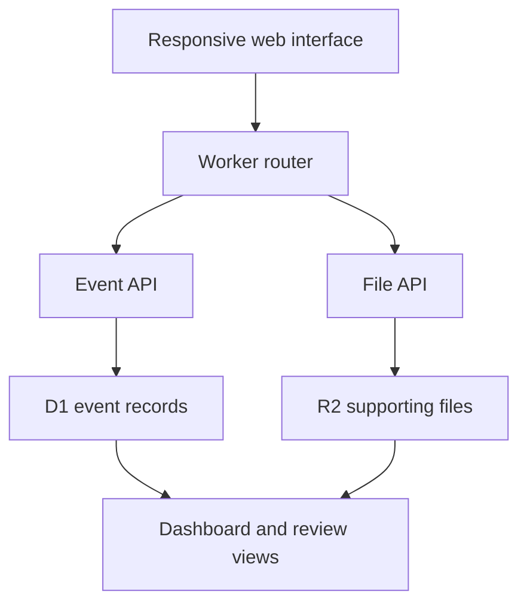

# Engineering Case Study

## UMKC NSBE Monthly Activity Report Tracker

**Role:** Project lead, product designer, and developer  
**Developer:** Abreham Mesfin  
**Organization:** National Society of Black Engineers — UMKC Chapter  
**Initial release:** July 2026  
**Development checkpoint:** Production version 71 on July 27, 2026

## Executive Summary

I designed and built a centralized web application for the UMKC NSBE Executive Board to replace a manual, fragmented activity-reporting process. The system organizes the chapter's 2026–2027 activity plan, tracks report readiness, stores supporting material, and gives Executive Board members one place to review work and leave feedback.

The result is a responsive, shared tracker containing 100 reporting records derived from 53 base activity IDs. It supports semester, month, week, lane, status, and undated views while preserving one master record for every activity.

This repository is a portfolio-safe copy of the application. The operational database, uploads, comments, and public editing URL are intentionally excluded.

## Problem

Activity-report preparation depended on information spread across calendars, forms, files, and conversations. That created four engineering and workflow problems:

1. The Board could not see full-year progress in one place.
2. Repeated activities and undated activities were difficult to count consistently.
3. Classification across NSBE programming lanes required repeatable rules.
4. Supporting files and review feedback were disconnected from the activity record.

The system also needed to remain understandable and maintainable after the original developer left the project.

## My Ownership

I owned the project from requirements through handoff:

- Translated the Executive Board's reporting process into application requirements.
- Reconciled the approved NSBE source material and chapter calendar into a 100-record baseline.
- Designed the information architecture, status workflow, filters, forms, and navigation.
- Defined the programming-lane classification rules and balancing approach.
- Built the responsive client interface and Worker API.
- Designed shared persistence using D1-compatible records and R2-compatible file storage.
- Added conflict-aware merging to reduce lost updates during concurrent editing.
- Iterated on usability, navigation, responsiveness, performance, and data correctness.
- Produced user guides and a development handoff for the next Executive Board.

## Requirements and Constraints

| Requirement | Engineering response |
|---|---|
| One reliable record per activity | Every view reads from the same master event record |
| Full-year visibility | Dashboard totals for Fall 2026, Spring 2027, and the full year |
| Repeated and undated activities | 100 report rows, including 95 dated occurrences and 5 undated activities |
| Consistent classification | Six primary programming lanes plus subcategories |
| Board review | Separate Executive Board Comments workspace |
| Supporting evidence | Multiple file uploads stored separately from event JSON |
| Shared use | D1-compatible persistence and optimistic concurrency merging |
| Mobile access | Responsive layouts and collapsible navigation |
| Operational continuity | User guides, source notes, known limitations, and handoff documentation |

## Data Engineering

The approved source material contained 53 base activity IDs, `NSBE-001` through `NSBE-053`. Some activities occurred more than once, so the tracker represents them as 100 report rows:

| Dataset segment | Count |
|---|---:|
| Fall 2026 reports | 53 |
| Spring 2027 reports | 47 |
| Dated occurrences | 95 |
| Undated activities | 5 |
| Total report rows | 100 |

I preserved all approved source records rather than silently dropping uncertain entries. Missing or conflicting source details remain visible as issue flags. This makes uncertainty reviewable and keeps the source baseline auditable.

## Classification Logic

The tracker uses six programming lanes. The governing rule is **fit first, balance second**:

1. Classify the activity by its actual reporting purpose.
2. When two lanes are both defensible, use current distribution counts to avoid unnecessary imbalance.
3. Require direct K–12 involvement for Pre-Collegiate Initiative.
4. Use Functional Zone Initiatives for ordinary meetings, social activities, membership events, and fundraisers.

This approach turns an informal judgment into an explainable decision process while keeping final control with the chapter.

## System Design

The application uses a compact Worker-compatible architecture:

- HTML, CSS, client-side behavior, seed data, API routing, and storage adapters are packaged in one deployable Worker.
- The `events` table stores a stable ID, the complete record as JSON, an update timestamp, and the updating identity supplied by the environment.
- Uploaded file bytes live in object storage; event records keep file metadata and references.
- Seed data provides a recoverable baseline when shared records are unavailable.
- Client routes preserve meaningful views across refreshes and browser history navigation.

The single-file design reduced deployment overhead for the initial chapter release. The tradeoff is lower modularity, which is recorded in the roadmap rather than hidden.

## Reliability and Multi-User Editing

Shared editing introduced a risk that one person's save could overwrite another person's newer changes. The application uses freshness metadata and conflict-aware record merging to reduce lost updates. Manual save states give users visible confirmation or failure feedback.

Other reliability work included:

- Preserving the active view across refresh.
- Supporting browser back and forward navigation.
- Avoiding an unnecessary dashboard flash during route restoration.
- Keeping the master list visible instead of automatically opening a single matching event.
- Falling back to the approved seed dataset when shared records cannot be loaded.

## Product Iteration

The project reached 71 saved production checkpoints by July 27, 2026. Iteration focused on real Board workflows:

- Renamed **Leadership Review** to **Executive Board Comments**.
- Replaced the ambiguous **Evidence** language with supporting-file terminology.
- Separated event details from Board comments.
- Added editable comments, multiple attachments, and selective deletion.
- Added direct status updates and red/yellow/green progress states.
- Added semester, month, week, lane, status, and undated navigation.
- Made status totals and comment counts actionable.
- Improved responsive behavior, sidebar controls, compact upload areas, and mobile layouts.
- Fixed status-update lag and supported repeated lane/subcategory changes with updated counts.
- Added clear filters, stable sorting, and browser-history behavior.

These were not cosmetic changes alone; they reduced navigation cost, clarified ownership, and made the shared workflow safer.

## Outcome

The completed system gives the Executive Board:

- One shared source for the full 2026–2027 reporting plan.
- Immediate progress visibility across 100 report rows.
- Traceable source issues instead of silently altered data.
- A repeatable programming-lane classification approach.
- Structured event details, comments, and supporting files.
- A documented handoff that another Board can continue.

## Engineering Tradeoffs

| Decision | Benefit | Tradeoff |
|---|---|---|
| Compact single Worker | Simple deployment and one runtime entry point | Harder to test and maintain as the codebase grows |
| JSON event records | Flexible schema during rapid iteration | Less relational validation and querying |
| Public operational access | Low-friction chapter collaboration | No role-based permissions or formal audit history |
| Seed data in source | Recoverable baseline and portable demo | Annual schedules require a source update |
| Manual national submission | Avoids automating an external process without an approved integration | The tracker confirms preparation, not official submission |

## What I Would Build Next

The next engineering phase is documented in [`ROADMAP.md`](../ROADMAP.md). Priorities are a read-only portfolio mode, role-based access, modular source organization, automated tests, and annual schedule import/export.

## Evidence in This Repository

- [`worker/index.js`](../worker/index.js) — complete application source and seed data
- [`README.md`](../README.md) — architecture, setup, privacy, and operational scope
- [`DEVELOPMENT_HISTORY.md`](DEVELOPMENT_HISTORY.md) — retrospective milestone history
- [`CHANGELOG.md`](../CHANGELOG.md) — released capabilities and documented changes
- [`ROADMAP.md`](../ROADMAP.md) — future engineering work and acceptance criteria

